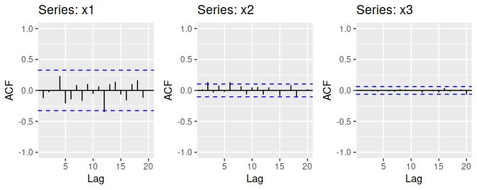

```{r message=FALSE, warning=FALSE}
if (!require("fpp2")) install.packages("fpp2")
if (!require("ggplot2")) install.packages("ggplot2")
if (!require("gridExtra")) install.packages("gridExtra")
library(fma)
library(forecast)
library(tseries)

```


### 8.1 Figure 8.31 shows the ACFs for 36 random numbers, 360 random numbers and 1,000 random numbers.

#### a. Explain the differences among these figures. Do they all indicate that the data are white noise?



**All three three plots indicate that the data is white noise. This is because none of the spikes are larger than the critical value range for any of the plots**

#### b. Why are the critical values at different distances from the mean of zero? Why are the autocorrelations different in each figure when they each refer to white noise?

**The formula for the critical values is $\pm 1.96/(\sqrt{T - d})$ where T is the sample size and d is the amount of differencing used. As the sample size increases the critical values get smaller. This explains why the cricial value region gets smaller (from left to right in the plot) as the sample size increases.**


### 8.2 A classic example of a non-stationary series is the daily closing IBM stock price series (data set `ibmclose`). Use R to plot the daily closing prices for IBM stock and the ACF and PACF. Explain how each plot shows that the series is non-stationary and should be differenced.

```{r fig.height=5, fig.width=8, fig.align='center'}
ggtsdisplay(ibmclose)
```

**There is clearly a trend element throughout the plot. The ACF plot shows that there are significant autocorrelations throughout. Therefore the data should be differenced in order to remove autocorrelation. **

### 8.3 For the following series, find an appropriate Box-Cox transformation and order of differencing in order to obtain stationary data.

#### a. `usnetelec`

```{r fig.align='center'}
plot(usnetelec)
```

**It is almost linearly increasing data. It looked like that the data only need first differencing.**

```{r}
Box.test(diff(usnetelec), type = "Ljung-Box")
```

**first differenced usnetelec data can be thought of as a white noise series**

```{r}
kpss.test(diff(usnetelec))
```

**kpss test result also shows that first differencing made the data stationary. **

#### b. `usgdp`

```{r fig.width=8, fig.align='center'}
plot(usgdp)
```

**It is almost linearly increasing data. It looked like that the data only need first differencing**

```{r}
Box.test(diff(usgdp), type = "Ljung-Box")
```

**first differenced usnetelec data cannot be thought of as a white noise series.**

```{r fig.width=8, fig.align='center'}
plot(diff(usgdp))
```

**There is still a trend left in the differenced data. It looked like one more differencing would be enough, but use ndiffs function to check the number of differencing needed.**

```{r}
ndiffs(usgdp)

```

```{r fig.width=8, fig.align='center'}
plot(diff(diff(usgdp)))
```

**Plot shows that the twice differenced data is like white noise series.**

```{r}
Box.test(diff(diff(usgdp)), type = "Ljung-Box")
```

```{r}
kpss.test(diff(diff(usnetelec)))
```

**But kpss test result shows that differencing twice was enough to make the data stationary. Therefore in usgdp data case, even if twice differencing didn't make the data like white noise series, it made the data stationary**


#### c. `mcopper`

```{r}
plot(mcopper)
```

**mcopper data have increasing trend. And they have bigger variation for bigger prices. Therefore I'll use Box-Cox transformation before differencing **

```{r}
lambda_mcopper <- BoxCox.lambda(mcopper)
plot(diff(BoxCox(mcopper, lambda_mcopper)))
Box.test(diff(BoxCox(mcopper, lambda_mcopper)),
         type = "Ljung-Box")
```

**Plot result looked like BoxCox transformation and first differencing made the data like white noise series. But Ljung-Box test shows that it didn't.**

```{r}
kpss.test(diff(BoxCox(mcopper, lambda_mcopper)))
```

**But kpss test result shows that differencing with Box-Cox transformation was enough to make the data stationary. Even if differencing with Box-Cox transformation didn't make the data like white noise series, it made the data stationary.**

#### d. `enplanements`

```{r}
plot(enplanements)
```

**enplanements data have seasonality and increasing trend even if the number of enplanements fell in 2001. Therefore, I think that the data need seasonal differencing, too. The variations are bigger for bigger numbers. Therefore I'll use Box-Cox transformation before differencing **


```{r}
lambda_enplanements <- BoxCox.lambda(enplanements)
ndiffs(enplanements)
```


```{r}
diff_enplane <- diff(BoxCox(enplanements, lambda_enplanements))
plot(diff_enplane)
```


```{r}
Box.test(diff_enplane,type = "Ljung-Box")
```

**Plot result looked like BoxCox transformation and multiple differencings made the data like white noise series. But Ljung-Box test shows that it didn't.**

```{r}
kpss.test(diff_enplane)
```


#### e. `visitors`

```{r}
plot(visitors)
```

**visitors data are similar to enplanements data. They have seasonality and increasing trend. It looked like they also need Box-Cox transformation, first and seasonal differencing.**

```{r}
lambda_visitors <- BoxCox.lambda(visitors)
ndiffs(visitors)
```

```{r}
diff_visit<- diff(BoxCox(visitors, lambda_visitors))

plot(diff_visit)

Box.test(diff_visit, type = "Ljung-Box")
```

**similar results like earliear example**

```{r}
kpss.test(diff_visit)
```
**But kpss test result shows that differencings with Box-Cox transformation was enough to make the data stationary. In visitors data case, even if differencings with Box-Cox transformation didn't make the data like white noise series, it made the data stationary.**

### 8.5

```{r}

```

** **
```{r}

```

** **

### 8.6

```{r}

```

** **
```{r}

```

** **

### 8.7

```{r}

```

** **
```{r}

```

** **